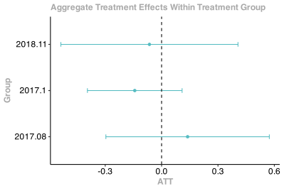
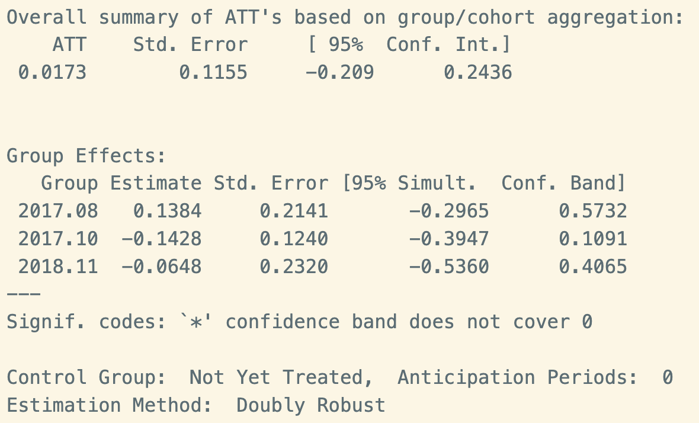
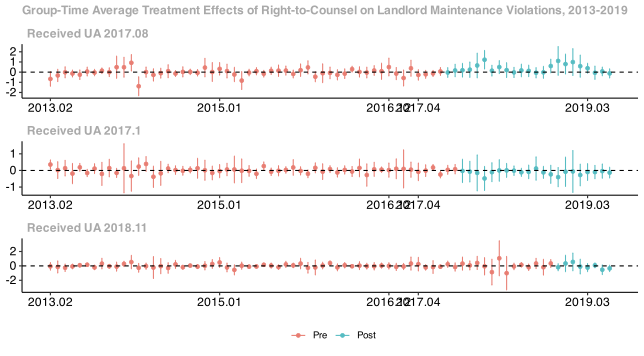
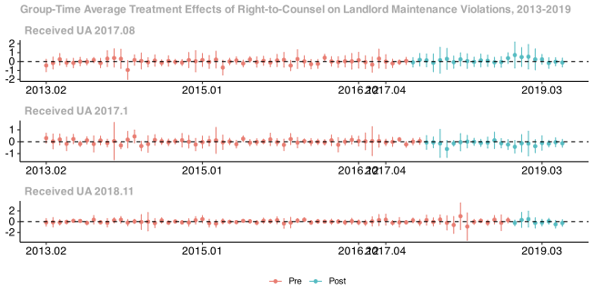

Notes for Team
================

This is just a scratchpad for all of us for now – I’m going to include a
runthrough of some of the initial scripts and a few rough violation
count visuals below. *SL, 02/19/2024*

### Data Sources

- [NYC HPD Housing Maintenance Code
  Violations](https://data.cityofnewyork.us/Housing-Development/Housing-Maintenance-Code-Violations/wvxf-dwi5)
- [ACS 5-yr estimates, 2012-2021](https://walker-data.com/tidycensus/)
- [NYC Planning PLUTO Archive,
  2012-2021](https://www.nyc.gov/site/planning/data-maps/open-data/bytes-archive.page)
- [NYC DOI Evictions
  Data](https://data.cityofnewyork.us/City-Government/Evictions/6z8x-wfk4/about_data)
- [Uniform Data System Mapper: ZIP to ZCTA
  Crosswalks](https://udsmapper.org/zip-code-to-zcta-crosswalk/)
- Callaway, Brantly and Pedro H.C. Sant’Anna.
  [“Difference-in-Differences with Multiple Time
  Periods”](https://doi.org/10.1016/j.jeconom.2020.12.001). *Journal of
  Econometrics*, Vol. 225, No. 2, pp. 200-230, 2021.
- Callaway, Brantly. [“Getting Started with the did
  Package”](https://bcallaway11.github.io/did/articles/did-basics.html).
  08-29-2023

### Dependent Libraries

``` r
library(tidyverse)   # data cleaning & manipulation
library(tidycensus)  # allows direct download of ACS microdata
library(RSocrata)    # pulls from NYC OpenData API
library(janitor)     # data cleaning & easy table percentages
library(lubridate)   # date variable normalization
library(viridis)     # plot color schemes
library(hrbrthemes)  # plots, but ~a~e~s~t~h~e~t~i~c~ 
library(did)         # Callaway & Sant'Anna's package implementing their staggered DiD method
```

### Data Structure

Raw and work-in-progress violation, Census, and treatment ZIP data are
in the raw and build data folders.

See “scripts” folder for more detailed runthrough of HPD’s Housing and
Maintenance Data. I called a subset via API of all heat, hw, and gas
related violations (*scripts/00_get_violations*); we can definitely do a
version with all class B and C, but at over 3M rows, it’s a bear to
download without chunking it out.

The raw data is stored at the violation level, where every row is one
unique record of a maintenance violation.

For analysis, I propose we collapse these by census tract to obtain a
panel of tract observations across all 12 years of our timeseries, with
violation counts stored as monthly totals for each tract and
operationalized into per-1,000-occupied-rental-unit-in-tract violation
rates. This allows us to generate summary data, but leaves the table
flexible enough to run staggered DiD analyses at the tract level where
year_month is accounted for in explanatory dummies and/or time fixed
effect.

Here’s a back-of-the-cocktail-napkin toy set showing that structure:

``` r
pencil_sketch <- list(
  tract = c(1, 1, 1, 2, 2),
  yr_mo = c(2017.08, 2017.09, 2017.10, 2017.11, 2017.12),
  violations = c(2, 0, 5, 1, 7),
  rtc = c(0, 0, 1, 1, 1),
  occ_rental_units = c(10, 10, 10, 8, 8)
)

pen_sketch <- data.frame(pencil_sketch) %>% 
  mutate(violation_intensity = (violations/occ_rental_units)*1000) %>% 
  print()
```

    ##   tract   yr_mo violations rtc occ_rental_units violation_intensity
    ## 1     1 2017.08          2   0               10                 200
    ## 2     1 2017.09          0   0               10                   0
    ## 3     1 2017.10          5   1               10                 500
    ## 4     2 2017.11          1   1                8                 125
    ## 5     2 2017.12          7   1                8                 875

See *scripts/01_get_census* for details and data structure of ACS 5-yr
estimates; note that we need to talk ways of filling out a full
timeseries with statistically comparable values (let’s work on PLUTO’s
archive for tract-level unit counts, but we can discuss pros & cons).

See *scripts/02_clean_violations* for merging in census data by
ZIP/ZCTA, generating 0/1 treatment indicators, treatment cohort groups,
and treatment dates.

See *scripts/03_summary_stats* is a work in progress; here are a few
very broad count visuals excerpted below.


See *scripts/04_pluto_clean* for an import of building-level tax record
data for geolocation and/or potential geographic boundary crosswalking.

### Data Analysis

Most of our work through January and February has focused on - further
data cleaning to identify and recode ZIP codes misentered by City
administrators - learning and implementing the logic behind Callaway &
Sant’Anna’s staggered difference-in-differences model - figuring out the
syntax requirements and interpretations of Callaway’s accompanying *did*
R package - researching the Universal Access policy rollout and
treatment selection criteria in order to refine our covariates -
refining our timeline boundaries on the basis of that research -
estimating treatment effects and looking for pretreatment parallel
trends - visualizing statistical findings

This ongoing work, shown in the *05_analysis* script, suggests that the
first-treated group in the UA rollout may on average have experienced a
slight *increase* in landlord heat & hot water violations after tenants
gained access to UA, while the next two waves may have experienced a
slight *decrease* – but our confidence intervals remain too broad for
these conclusions to be fully statistically significant.




Since Callaway & Sant’Anna’s model calls for covariates that remind
constant across multiple periods, we control for baseline covariates
that align with UA treatment critera, including: - 2017 eviction rate
per ZIP (as total 2017 pending, scheduled, and executed evictions in ZIP
/ total renter-occupied units in ZIP per 2017 ACS estimate) - 2017 rent
stabilization rate per ZIP (as total 2017 rent-stabilized units in ZIP /
total renter-occupied units in ZIP per 2017 ACS estimate) - 2017 poverty
rate per ZIP (as number of households in ZIP below 2017 Federal poverty
line / number of renter-occupied units in ZIP per 2017 ACS estimate)

*Before* introducing these covariates, the three cohorts who received
treatment prior to our June 2019 cutoff date do not exhibit parallel
pre-treatment trends.



*After* including these covariates, our model continues to suggest that
treatment cohorts did not exhibit strictly parallel pre-treatment
trends.



### Next Steps & Big Questions

While it’s possible that there simple isn’t a statistically significant
causal relationship between tenants’ access to eviction protections and
landlords’ attempts to evict through extralegal means such as heat & hot
water shutoffs, our current issue may also be caused by the following: -
Since we have hundreds of time periods but relatively small groups of
ZIPs within each treatment cohort, it’s possible that lack of
statistical significance is coming from **small sample size**. While
time-consuming, we could revisit crosswalking census tract and ZCTA
boundaries to estimate violation rate at the tract rather than ZIP
level. - Lack of statistically significant treatment effect may also be
caused by **misspecified R code**. We’ll look at whether we’ve encoded
time periods correctly (Callaway’s package requires treatment times to
be expressed numerically rather than as date objects, which introduces
some room for coder error in the year_month variable). - Finally, we may
simply need to **further adjust our covariates** to better isolate
ATE/ATT across a staggered rollout. - Since we’re pursuing heat & water
violations as a proxy for illegal evictions, we could also take the more
drastic measure of changing our outcome variable to a different proxy
for the same behavior – for instance, rental unit vacancy rate. This
would, however, require further research to confirm data collection
reliability.
