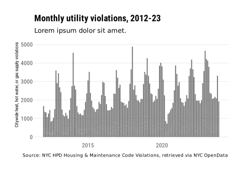
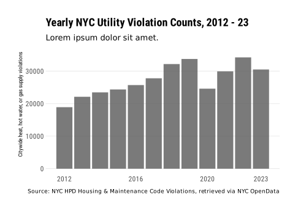
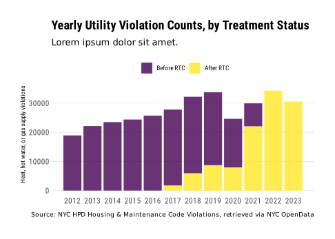
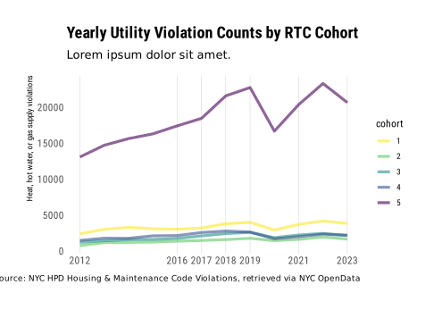

Notes for Team
================

This is just a scratchpad for all of us for now – I’m going to include a
runthrough of some of the initial scripts and a few rough violation
count visuals below. *SL, 11/17/2024*

### Data Sources

- [NYC HPD Housing Maintenance Code
  Violations](https://data.cityofnewyork.us/Housing-Development/Housing-Maintenance-Code-Violations/wvxf-dwi5)
- [ACS 5-yr estimates, 2012-2021](https://walker-data.com/tidycensus/)
- [NYC Planning PLUTO Archive,
  2012-2021](https://www.nyc.gov/site/planning/data-maps/open-data/bytes-archive.page)
- [Uniform Data System Mapper: ZIP to ZCTA
  Crosswalks](https://udsmapper.org/zip-code-to-zcta-crosswalk/)

### Dependent Libraries

``` r
library(tidyverse)   # data cleaning & manipulation
library(tidycensus)  # allows direct download of ACS microdata
library(RSocrata)    # pulls from NYC OpenData API
library(janitor)     # data cleaning & easy table percentages
library(lubridate)   # date variable normalization
library(viridis)     # plot color schemes
library(hrbrthemes)  # plots, but ~a~e~s~t~h~e~t~i~c~    
```

### Data Structure

Raw and work-in-progress violation, Census, and treatment ZIP data are
in the raw and build data folders.

See “scripts” folder for more detailed runthrough of HPD’s Housing and
Maintenance Data. I called a subset via API of all heat, hw, and gas
related violations (*scripts/00_get_violations*); we can definitely do a
version with all class B and C, but at over 3M rows, it’s a bear to
download without chunking it out.

The raw data is stored at the violation level, where every row is one
unique record of a maintenance violation.

For analysis, I propose we collapse these by census tract to obtain a
panel of tract observations across all 12 years of our timeseries, with
violation counts stored as monthly totals for each tract and
operationalized into per-1,000-occupied-rental-unit-in-tract violation
rates. This allows us to generate summary data, but leaves the table
flexible enough to run staggered DiD analyses at the tract level where
year_month is accounted for in explanatory dummies and/or time fixed
effect.

Here’s a back-of-the-cocktail-napkin toy set showing that structure:

``` r
pencil_sketch <- list(
  tract = c(1, 1, 1, 2, 2),
  yr_mo = c(2017.08, 2017.09, 2017.10, 2017.11, 2017.12),
  violations = c(2, 0, 5, 1, 7),
  rtc = c(0, 0, 1, 1, 1),
  occ_rental_units = c(10, 10, 10, 8, 8)
)

pen_sketch <- data.frame(pencil_sketch) %>% 
  mutate(violation_intensity = (violations/occ_rental_units)*1000) %>% 
  print()
```

    ##   tract   yr_mo violations rtc occ_rental_units violation_intensity
    ## 1     1 2017.08          2   0               10                 200
    ## 2     1 2017.09          0   0               10                   0
    ## 3     1 2017.10          5   1               10                 500
    ## 4     2 2017.11          1   1                8                 125
    ## 5     2 2017.12          7   1                8                 875

See *scripts/01_get_census* for details and data structure of ACS 5-yr
estimates; note that we need to talk ways of filling out a full
timeseries with statistically comparable values (let’s work on PLUTO’s
archive for tract-level unit counts, but we can discuss pros & cons).

See *scripts/02_clean_violations* for merging in census data by
ZIP/ZCTA, generating 0/1 treatment indicators, treatment cohort groups,
and treatment dates.

Lastly, *scripts/03_summary_stats* is a work in progress; here are a few
very broad count visuals excerpted below.






