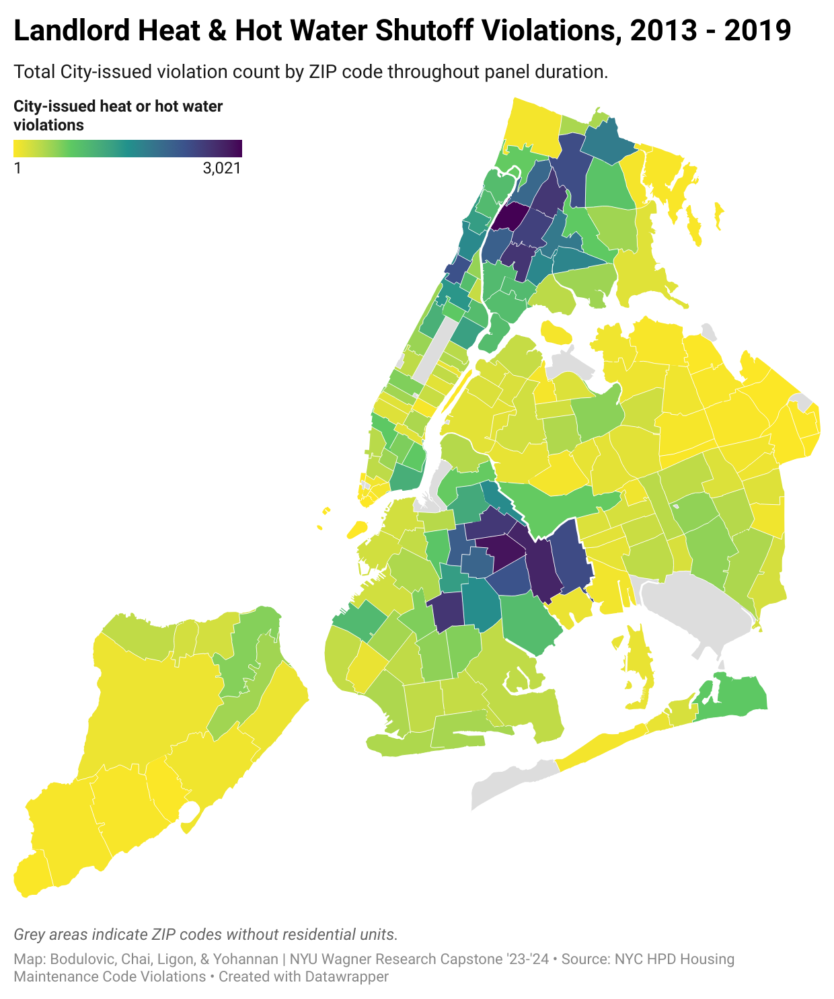

Tony Bodulovic, Jiayi Chai, Sarah Ligon, & Reba Yohannan\
NYU Wagner Research Capstone '23 - '24\
April 1, 2024

Project R scripts and data at [github.com/ligonish/nyu-capstone-F23-S24](https://github.com/ligonish/nyu-capstone-F23-S24).

*Last updated 2024-03-02, SL*

```{r setup, include = FALSE}
#knitr::opts_chunk$set(warning = FALSE, message = FALSE)
library(knitr)
knitr::opts_chunk$set(message = FALSE)
knitr::opts_chunk$set(cache.extra = rand_seed)
options(tigris_use_cache = TRUE) # runs faster
options(scipen=999) # removes scientific notation in GEOID field etc
```

<center>{width=50%}{width=50%}</center>

## Data Sources

-   [NYC HPD Housing Maintenance Code Violations](https://data.cityofnewyork.us/Housing-Development/Housing-Maintenance-Code-Violations/wvxf-dwi5)
-   [ACS 5-yr estimates, 2012-2021](https://walker-data.com/tidycensus/)
-   [NYC DOHMH Zip Code Tabulation Areas](https://data.cityofnewyork.us/Health/Modified-Zip-Code-Tabulation-Areas-MODZCTA-/pri4-ifjk/data)
-   [NYC Planning PLUTO Archive, 2012-2021](https://www.nyc.gov/site/planning/data-maps/open-data/bytes-archive.page)
-   [NYC DOI Evictions Data](https://data.cityofnewyork.us/City-Government/Evictions/6z8x-wfk4/about_data)
-   [JustFix NYC Rent Stabilized Unit Counts](https://www.justfix.org/en/tools)
-   [Uniform Data System Mapper: ZIP to ZCTA Crosswalks](https://udsmapper.org/zip-code-to-zcta-crosswalk/)
-   Callaway, Brantly and Pedro H.C. Sant'Anna. ["Difference-in-Differences with Multiple Time Periods"](https://doi.org/10.1016/j.jeconom.2020.12.001). *Journal of Econometrics*, Vol. 225, No. 2, pp. 200-230, 2021.
-   Callaway, Brantly and Pedro Sant'Anna. ["Getting Started with the did Package"](https://bcallaway11.github.io/did/articles/did-basics.html). 08-29-2023

## R Libraries

```{r}
library(tidyverse)   # data cleaning & manipulation
library(tidycensus)  # allows direct download of ACS microdata
library(RSocrata)    # pulls from NYC OpenData API
library(janitor)     # data cleaning & easy table percentages
library(readxl)      # import Census.gov ZIP->ZCTA crosswalks from .xls format
library(priceR)      # CPI-adjust dollar amounts
library(campfin)     # normalize address spellings
library(lubridate)   # date variable normalization
library(zoo)         # stores evenly-counted year-month periods as numeric variables
library(did)         # Callaway & Sant'Anna's package implementing their staggered DiD method
library(viridis)     # plot color schemes
library(hrbrthemes)  # plot theming 
library(kableExtra)  # prettier tables
library(vtable)      # summary stats in RMarkdown

```

## Data Collection

### NYC-HPD Housing & Maintenance Code Violations, 2013 - 2019

To use this method, you'll need your own free app token to access NYC OpenData APIs. You can get one at [data.cityofnewyork.us/profile/edit/developer_settings](https://data.cityofnewyork.us/profile/edit/developer_settings). Once you have it, store locally on your machine in place of the "XXXXXXXXX" value below.

```{r, include = FALSE}
token <- "7364W6XxzbdfnyrT35ZCO40Vs"
```

```{r}
#token <- "XXXXXXXXXXXXXXXXXXXX"
```

Now visit <https://nycopendata.socrata.com/Housing-Development/Housing-Maintenance-Code-Violations/wvxf-dwi5> and click the "API" tab. Choose "CSV" for API Endpoint and copy the resulting [URL](https://data.cityofnewyork.us/resource/wvxf-dwi5.csv).

The above URL contains 8.5 million rows, going all the way back to the early 1990s. We only need data from 2016 onward, so let's simplify. See <https://dev.socrata.com/docs/queries/> for list of Socrata queries for filtering; the syntax is SQL-like. Tutorial at <https://hwangnyc.medium.com/using-r-to-access-311-service-request-from-nyc-open-data-using-socrata-open-data-api-and-the-83de00327a8c> Further detail on Housing Maintenance Code Violation storage & structure at <https://dev.socrata.com/foundry/data.cityofnewyork.us/wvxf-dwi5>

HPD publishes a codebook detailing inspectors' violation codes (see documentation/Housing_Maintenance_Code_Violations_User_Guide on our Github). We select the following subset of particularly severe heat and hot water shutoff violation categories as proxies for illegal eviction.

```{r}
v_codes <- c(577, 664, 666, 670, 742, 877, 964, 966, 970)

v_adm <- c("§27-2024", "§27-2028, 2032", "§27-2029", "§27-2031", "§27-2070", "§27-2024", "§27-2028, 2032", "§27-2029", "§27-2031")

v_desc <- c("PROVIDE ADEQUATE SUPPLY OF HOT WATER FOR THE FIXTURES", "PROVIDE AN ADEQUATE SUPPLY OF HEAT FROM AN APPROVED CENTRAL
 HEATING SYSTEM, OR AN APPROVED SYSTEM OF GAS OR ELECTRICAL HEATING IN GOOD OPERATING CONDITION FOR THE DWELLING UNIT", "PROVIDE AN ADEQUATE SUPPLY OF HEAT FOR THE APARTMENT", "PROVIDE HOT WATER AT ALL HOT WATER FIXTURES", "PROVIDE AN ADEQUATE SUPPLY OF GAS TO THE FIXTURES", "PROVIDE ADEQUATE SUPPLY OF HOT WATER FOR THE FIXTURES", "PROVIDE AN ADEQUATE SUPPLY OF HEAT FROM AN APPROVED CENTRAL
 HEATING SYSTEM, OR AN APPROVED SYSTEM OF GAS OR ELECTRICAL HEATING IN GOOD OPERATING CONDITION FOR THE DWELLING UNIT", "PROVIDE AN ADEQUATE SUPPLY OF HEAT FOR THE APARTMENT", "PROVIDE HOT WATER AT ALL HOT WATER FIXTURES")

tibble(v_codes, v_adm, v_desc) %>%
  kbl(caption = 'Table 5. NYC HPD Housing Maintenance Violation Categories Selected for Study',
      col.names = c('Code', 'NYC Law', 'HPD Description')) %>% 
    kable_styling(full_width = F, html_font = "Roboto Condensed") %>% 
  add_footnote("Source: NYC HPD Housing Maintenance Code Violations, NYC OpenData, accessed 03/03/2024.", notation="none")

rm(v_adm, v_codes, v_desc)
```

Requesting these directly from NYC OpenData's API, with date range beginning in 2013 (the first complete year of digitized HPD reports) and ending before the passage of HSTPA in June 2019:

```{r}
url <- "https://data.cityofnewyork.us/resource/wvxf-dwi5.json?$where= inspectiondate >= '2013-01-01T00:00:00.000' and inspectiondate <= '2019-05-31T00:00:00.000' and (ordernumber = '577' or ordernumber = '664' or ordernumber = '666' or ordernumber = '670' or ordernumber = '742' or ordernumber = '877' or ordernumber = '964' or ordernumber = '966' or ordernumber = '970')"

violations <- read.socrata(url = url, app_token = token) 

rm(token, url)
```

*10,4050 obs. of 41 variables*

### U.S. Census: ZIP-Level ACS 5-Year Estimates

Start by getting a U.S. Census API key and storing it on your local system. Here's a [general tutorial](https://walker-data.com/tidycensus/articles/spatial-data.html); a [NYC-specific, tidyverse-friendly guide](https://justinmorganwilliams.medium.com/import-nyc-census-data-into-r-with-tidycensus-c94d2d1f23fa); and a great writeup on pulling [multiple years at once](https://mattherman.info/blog/tidycensus-mult-year/) using purrr loops (method replicated below).

Tidycensus lets you browse all the available variables by year and census type. Here we pull the codebook for 2017 5-year estimates, though 1-year and decennial estimates are also available in the *tidyverse* package:

```{r}
v17 <- load_variables(2017, "acs5")
```

We select a range of potential covariates from the renter-occupied housing universe:

```{r}
census_variables <- c("B25001_001",   # Total housing units (added 2-18-2024, SL)
                      "B25002_003",   # Total vacant housing units (added 2-18-2024, SL)
                      "B25032_001",   # Total occupied housing units (added 2-8-2024, SL: for pct_rent estimation)
                      "B25032_013",   # Total renter-occupied housing units 
                      "B25008_003",   # Total population in renter-occupied housing units
                      "B25119_003",   # Median household income (renter-occupied) 
                      "B25037_003",   # Median year structure built (renter-occupied) 
                      "B25039_003",   # Median year householder moved into unit (renter-occupied)
                      "B25064_001",   # Median gross rent (dollars)
                      "B25071_001",   # Median gross rent as percentage of household income in past 12 months (i.e. rent burden)
                      "B25013_011",   # Total renter-occupied housing units where householder has bachelors' degree or higher
                      "B25003H_003",  # Total rent-occ units where householder is white alone, not Hispanic or Latino
                      "B25003B_003",  # Total rent-occ units where householder is Black alone
                      "B25003D_003",  # Total rent-occ units where householder is Asian alone
                      "B25003I_003",  # Total rent-occ units where householder is Hispanic or Latino
                      "B17017_001",   # Total households
                      "B17017_002"    # Total households w/ income below poverty threshold in past yr
                      ) 

rm(v17)
```

And the years in our date range of interest:

```{r}
years <- lst(2013, 2014, 2015, 2016, 2017, 2018, 2019) 
```

Obtaining seven years' worth of ZIP-level ACS estimates.

```{r}
acs5_zctas <- map_dfr(
  years,
  ~ get_acs(
    geography = "zcta",
    variables = census_variables,
    year = .x,
    survey = "acs5",
    output = "wide",
    geometry = FALSE),   # can add these later for mapping
  .id = "year") %>%
  select(-NAME, -ends_with("M")) %>% 
  mutate(year = as.numeric(year))%>% 
  arrange(GEOID, year)

rm(years, census_variables)
```

*231,840 obs. of 19 vars* 

After trimming these to only include ZIP codes within New York City, using a c. 2010 ZIP/ZCTA list downloaded from NYC OpenData:

```{r}
zctas <- read_csv("../data_build/2010_nyc_zctas.csv") %>% 
  mutate(GEOID = as.character(ZCTA))
```

*216 obs. of 2 vars* 

We rename the variables more legibly and generate our covariates of interest as rates within each ZIP boundary for easier comparability across ZIPs.

```{r}
acs5_zctas <- acs5_zctas %>% 
  semi_join(zctas, by = "GEOID") %>% 
  rename(tot_units = B25001_001E,
         tot_occ_units = B25032_001E,
         tot_vac_units = B25002_003E,
         renter_occ_units = B25032_013E,
         tot_hh = B17017_001E,
         tot_hh_pov = B17017_002E,
         tot_pop_rou = B25008_003E,
         med_hh_inc_rou = B25119_003E,
         med_yr_blt_rou = B25037_003E,
         med_yr_moved_in_rou = B25039_003E,
         med_gross_rent = B25064_001E,
         med_rent_burden = B25071_001E,
         tot_college_degree_rou = B25013_011E,
         tot_wh_rou = B25003H_003E,
         tot_bl_rou = B25003B_003E,
         tot_asn_rou = B25003D_003E,
         tot_ltx_rou = B25003I_003E
         ) %>% 
  mutate(med_gross_rent_2020_adj = adjust_for_inflation(med_gross_rent, year, "US", to_date = 2020),
         med_gross_rent_2020_adj = round_to_nearest(med_gross_rent_2020_adj, 1), .after = med_gross_rent) %>% 
  mutate(med_hh_inc_rou_2020_adj = adjust_for_inflation(med_hh_inc_rou, year, "US", to_date = 2020),
         med_hh_inc_rou_2020_adj = round_to_nearest(med_hh_inc_rou_2020_adj, 1), .after = med_hh_inc_rou) %>% 
  mutate(pct_college_deg_rou = round(tot_college_degree_rou/renter_occ_units, 2), .after = tot_college_degree_rou) %>% 
  mutate(pct_wh_rou = round(tot_wh_rou/renter_occ_units, 2), .after = tot_wh_rou) %>% 
  mutate(pct_bl_rou = round(tot_bl_rou/renter_occ_units, 2), .after = tot_bl_rou) %>% 
  mutate(pct_asn_rou = round(tot_asn_rou/renter_occ_units, 2), .after = tot_asn_rou) %>%
  mutate(pct_ltx_rou = round(tot_ltx_rou/renter_occ_units, 2), .after = tot_ltx_rou) %>% 
  mutate(pct_rent = round(renter_occ_units/tot_occ_units, 2), .after = renter_occ_units) %>% 
  mutate(pct_vac = round(tot_vac_units/tot_occ_units, 2), .after = tot_vac_units) %>% 
  mutate(pct_pov = round(tot_hh_pov/tot_hh, 2), .after = tot_hh_pov) %>% 
  fill(med_hh_inc_rou, med_hh_inc_rou_2020_adj, med_yr_moved_in_rou) # impute from prev yr the missing values for 2015 household income & median year moved in ZIP 10006, and 2016 hh inc for ZIP 10464

rm(zctas)
```

*1498 obs of 29 vars*

###U.S. Census: Tract-Level Estimates

```{r}
counties <- c("Bronx", "Kings", "New York", "Queens", "Richmond") # so we don't get the whole of NY state in one file
```

```{r}
acs5_tracts_12_23 <- map_dfr(
  years,
  ~ get_acs(
    geography = "tract",
    state = "NY",
    county = counties,
    variables = census_variables,
    year = .x,
    survey = "acs5",
    output = "wide",
    geometry = FALSE  # can set to "T" for sf mapping down the line
  ),
  .id = "year"  
) %>%
  select(-ends_with("M")) %>%  # removing superfluous margin of error estimates
  arrange(GEOID, year)
```

```{r}
acs5_tracts_12_23 <- acs5_tracts_12_23 %>% 
  rename(tot_units = B25001_001E,
         tot_occ_units = B25032_001E,
         tot_vac_units = B25002_003E,
         renter_occ_units = B25032_013E,
         tot_hh = B17017_001E,
         tot_hh_pov = B17017_002E,
         tot_pop_rou = B25008_003E,
         med_hh_inc_rou = B25119_003E,
         med_yr_blt_rou = B25037_003E,
         med_yr_moved_in_rou = B25039_003E,
         med_gross_rent = B25064_001E,
         med_rent_burden = B25071_001E,
         tot_college_degree_rou = B25013_011E,
         tot_wh_rou = B25003H_003E,
         tot_bl_rou = B25003B_003E,
         tot_asn_rou = B25003D_003E,
         tot_ltx_rou = B25003I_003E
  ) %>%  
  mutate(med_gross_rent_2020_adj = adjust_for_inflation(med_gross_rent, year, "US", to_date = 2020),
         med_gross_rent_2020_adj = round_to_nearest(med_gross_rent_2020_adj, 1), .after = med_gross_rent) %>% 
  mutate(med_hh_inc_rou_2020_adj = adjust_for_inflation(med_hh_inc_rou, year, "US", to_date = 2020),
         med_hh_inc_rou_2020_adj = round_to_nearest(med_hh_inc_rou_2020_adj, 1), .after = med_hh_inc_rou) %>% 
  mutate(pct_college_deg_rou = round(tot_college_degree_rou/renter_occ_units, 2), .after = tot_college_degree_rou) %>% 
  mutate(pct_wh_rou = round(tot_wh_rou/renter_occ_units, 2), .after = tot_wh_rou) %>% 
  mutate(pct_bl_rou = round(tot_bl_rou/renter_occ_units, 2), .after = tot_bl_rou) %>% 
  mutate(pct_asn_rou = round(tot_asn_rou/renter_occ_units, 2), .after = tot_asn_rou) %>%
  mutate(pct_ltx_rou = round(tot_ltx_rou/renter_occ_units, 2), .after = tot_ltx_rou) %>% 
  mutate(pct_rent = round(renter_occ_units/tot_occ_units, 2), .after = renter_occ_units) %>% 
  mutate(pct_vac = round(tot_vac_units/tot_occ_units, 2), .after = tot_vac_units) %>% 
  mutate(pct_pov = round(tot_hh_pov/tot_hh, 2), .after = tot_hh_pov) 
```

```{r}
write_csv(acs5_tracts_12_23, "../data_build/acs5_tracts_12_23_renter_occ_units.csv")
```

### NYC-DOI Eviction Counts

```{r}
evict <- read_csv("../data_raw/jan_to_aug_evictions_2017.csv") %>% # 2017 baseline Jan-Aug eviction counts, by DOI and collated in NYC OpenData
  clean_names %>% 
  mutate(zip = as.numeric(eviction_postcode), .keep = "unused") %>% 
  rename(evicts_17 = count)
```

*183 obs of 2 vars*

### NYC-JustFix Rent Stabilization Counts

```{r}
rs <- read_csv("../data_build/rs_17_full.csv") %>%   # baseline 2017 rent-stabilized unit counts, via Furman + Tony
  mutate(zip = as.numeric(zipcode), .keep = "unused") %>% 
  rename(rs_17 = rs_17_count)
```

*175 obs ov 2 vars*

### RTC treatment dates & indicators

```{r, warning = FALSE}
rtc_zips <- read_csv("../data_build/rtc_zip_rollout.csv") %>% # Source: Ellen et al (2021), "Early Evidence on Eviction Patterns", pg.8 footnotes
  clean_names() %>% 
  mutate(zip = as.numeric(zip)) %>% 
  rename(rtc_treat_date = date_added) %>% 
  select(cohort, rtc_treat_date, zip) %>%
  filter(cohort != 5)
```

*25 obs of 2 vars*

## ZIP-Level Data Cleaning

```{r}
violations <- violations %>% 
  remove_constant() %>% 
  select(violationid,
         buildingid,
         boroid,
         boro,
         housenumber,
         lowhousenumber,
         highhousenumber,
         streetname,
         zip, 
         apartment,
         story,
         block,
         lot,
         class,
         inspectiondate,
         ordernumber,
         novdescription,
         novtype,
         rentimpairing,
         latitude,
         longitude,
         censustract,
         bin,
         bbl,
         nta) %>% 
  mutate(inspectiondate = date(inspectiondate),  # baseline date for each observation; earlier date would require using complaints database instead/as well
         inspection_yr = year(inspectiondate),  # for manipulation/visualization/interactions  
         inspection_mo = month(inspectiondate), # allows analysis of seasonal trends and overall more detailed time-constant fixed effects (esp important in staggered DiD)
         inspection_yr_mo = as.yearmon(inspectiondate),
         zip = as.integer(zip),
         violationid = as.integer(violationid))
```

*104,050 obs of 28 vars*

Fix missing or mis-entered ZIPs

```{r}
corrected_zips <- read.csv("../data_build/corrected_zips_2012_2020.csv") %>%  # hand corrected by Jiayi/Reba
  mutate(inspectiondate = date(inspectiondate),  # keeps date syntax compatible with rest of data after merge
         inspection_yr = year(inspectiondate),  
         inspection_mo = month(inspectiondate), 
         inspection_yr_mo = as.yearmon(inspectiondate)) 

violations <- violations %>% 
  filter(zip != "2016",   # two ZIPs mis-entered as "2016"
         !is.na(zip)) %>%
  bind_rows(corrected_zips) %>%   # updated from rbind.fill to dplyr syntax so rest of code runs in tidyverse
  mutate(zip = case_when( # correcting a few further misentered ZIPs discovered during later analysis
    zip == 10129 ~ 10128, # violation ID 11725954 entered with ZIP typo
    zip == 10435 ~ 11435, # violation ID 10549312 entered with ZIP typo
    zip == 11452 ~ 10452, # violation IDs 10599781 & 10599866 entered with ZIP typos
    zip == 11249 ~ 11211, # c. 2010 ZIP 11249 corresponds to c. 2010 ZCTA 11211, both adjacent in Williamsburg; all other ZIPS/ZCTAs mergeable
    TRUE ~ zip
  )) 

```

*104,063 obs of 28 vars*

Collapse to get monthly violation totals at ZIP code level

```{r}
violations <- violations %>% 
  group_by(zip, inspection_yr_mo) %>% 
  summarize(n_violations = n_distinct(violationid, na.rm = F)) %>%     # 17,640 obs from Jan 2012 - Feb 2020 
  ungroup() %>% 
  complete(zip, inspection_yr_mo, fill = list(n_violations = 0)) # expand all 12 annual yearmonth observations for all zip codes, even if no violations reported
```

*14,608 obs of 3 vars*

Merge/generate census, eviction, & rent stabilization covariates

```{r}
acs5_zctas <- acs5_zctas %>% 
  rename(zip = GEOID) %>% 
  mutate(zip = as.integer(zip))
```

```{r}
violations <- violations %>% 
  mutate(year = year(inspection_yr_mo)) %>%  
  group_by(zip, inspection_yr_mo) %>% 
  left_join(acs5_zctas, by = c("year", "zip")) %>%   # Census covariates
  left_join(evict, by = "zip") %>%    # eviction covariate
  left_join(rs, by = "zip") %>%   # rent stabilization covariate 
  mutate(n_violations_per_1k_units = ((n_violations/renter_occ_units)*1000), .after = n_violations) %>% 
  ungroup() %>% 
  group_by(zip) %>% 
  mutate(across(everything(), ~replace(.x, is.nan(.x), 0))) %>% # correcting generated percentages with "0" numerators that were showing up as NaN values
  mutate(
    evict_rate_17 = case_when(
      year == 2017 ~ (evicts_17/renter_occ_units)),   # time-invariant baseline version of eviction rate from treatment selection year, for CS-DiD
    rs_rate_17 = case_when(
      year == 2017 ~ (rs_17/renter_occ_units)),   # time-invariant rent stabilization rate
    pct_pov_17 = case_when(
      year == 2017 ~ pct_pov),   # time-invariant poverty rate
    pct_wh_17 = case_when(
      year == 2017 ~ pct_wh_rou)   # time-invariant control for baseline POC residents at treatment selection year
  ) %>% 
  fill(evict_rate_17, rs_rate_17, pct_pov_17, pct_wh_17, .direction = "updown") %>% 
  select(-year) %>% 
  ungroup()
```

*14,608 obs of 37 vars*

Generate RTC treatment status dates & indicators

```{r}
violations <- violations %>% 
  group_by(zip, inspection_yr_mo) %>% 
  left_join(rtc_zips, by = "zip") %>% 
  mutate(
    cohort = replace_na(cohort, 5),
    rtc_treat_date = replace_na(rtc_treat_date, as_date("2021-05-11")), # all ZIPS not in cohorts 1-4 were added to treatment May 2021
    treat_yr_mo = as.yearmon(rtc_treat_date),
    treated = case_when(
      treat_yr_mo > inspection_yr_mo ~ 0,
      TRUE ~ 1)) %>% 
  ungroup
```

Select pre-HSTPA time period

```{r}
violations <- violations %>% 
  filter(inspection_yr_mo >= "Jan 2013" & inspection_yr_mo <= "May 2019") %>% 
  mutate(zip = as.character(zip))

rm(corrected_zips, evict, rs, rtc_zips)
```

*13,552 observations of 41 variables.*

## ZIP-Level Summary Statistics

Table 1(a)

```{r}
labels = c("Total violations",
           "Violations per 1k units",
           "Total housing units",
           "Total vacant housing units",
           "% vacant housing units",
           "Total occupied housing units",
           "Total renter-occupied units",
           "% housing units renter-occupied",
           "Renter population",
           "Median renter hh income",
           "Median renter hh inc in 2020 USD",
           "Median year built",
           "Median year moved into unit",
           "Median gross rent",
           "Median gross rent in 2020 USD",
           "Median rent burden",
           "Total renter householders with college degree",
           "% renter householders with college degree",
           "Total white renter householders",
           "% white renter householders",
           "Total Black renter householders",
           "% Black renter householders",
           "Total Asian renter householders",
           "% Asian renter householders",
           "Total Hispanic/Latinx renter householders",
           "% Hispanic/Latinx renter householders",
           "Total households",
           "Total hh below Federal poverty line",
           "% hh below Federal poverty line",
           "Total evictions in 2017",
           "Total rent-stabilized units in 2017",
           "% renter-occupied unit evictions in 2017",
           "% renter-occupied units rent-stabilized in 2017",
           "% hh below Federal poverty line in 2017",
           "% white renter householders in 2017",
           "")

violations %>% 
  ungroup() %>% 
  mutate(cohort = factor(cohort),
         treated = factor(treated)) %>% 
  st(group = 'cohort',
     group.test = T,
     col.align = 'center',
     labels = labels,
     title = 'Table 1(a). Summary Statistics by ZIP-Level RTC Treatment Cohort: NYC Renter-Occupied Units, January 2013 - May 2019',
     out = 'kable') %>% 
  kable_styling(full_width = F, 
                html_font = "Roboto Condensed",
                bootstrap_options = c("condensed", "striped"))
```

Key Covariate Summaries, by Cohort (to highlight heterogeneity)

```{r}
violations %>% 
  group_by(cohort) %>%
  summarize(
    #violations = sum(n_violations),
            violation_rate = mean(n_violations_per_1k_units, na.rm = TRUE),
            evict_rate = mean(evict_rate_17, na.rm = TRUE),
            rs_rate = mean(rs_rate_17, na.rm = TRUE),
            pct_pov = mean(pct_pov_17, na.rm = TRUE),
            hh_inc = mean(med_hh_inc_rou_2020_adj, na.rm = TRUE),
            rent_burden = mean(med_rent_burden, na.rm = TRUE),
            pct_college_grads = mean(pct_college_deg_rou, na.rm = TRUE),
            pct_wh = mean(pct_wh_rou, na.rm = TRUE),
            pct_bl = mean(pct_bl_rou, na.rm = TRUE),
            pct_asn = mean(pct_asn_rou, na.rm = TRUE),
            pct_ltx = mean(pct_ltx_rou, na.rm = TRUE)
            ) %>% 
  knitr::kable(digits = 2,
               caption = 'Selected Potential Covariates by RTC Treatment Cohort: NYC Renter-Occupied Units, January 2012 - May 2019',
               col.names = c("Treatment Cohort", "Violation Rate", "2017 Eviction Rate", "2017 Rent Stabilization Rate", "2017 Poverty Rate", "Median HH Income in 2020 USD", "Rent Burden", "Percent College Graduates", "Percent White", "Percent Black", "Percent Asian", "Percent Latinx"),
               align = "c") %>% 
  kable_styling(full_width = F, html_font = "Roboto Condensed")
  
```


```{r}
for_maps <- violations %>% 
  group_by(cohort, zip) %>%
  summarize(violations = sum(n_violations),
            violation_rate = mean(n_violations_per_1k_units, na.rm = TRUE),
            evict_rate = mean(evict_rate_17, na.rm = TRUE),
            rs_rate = mean(rs_rate_17, na.rm = TRUE),
            pct_pov = mean(pct_pov_17, na.rm = TRUE),
            hh_inc = mean(med_hh_inc_rou_2020_adj, na.rm = TRUE),
            rent_burden = mean(med_rent_burden, na.rm = TRUE),
            pct_college_grads = mean(pct_college_deg_rou, na.rm = TRUE),
            pct_wh = mean(pct_wh_rou, na.rm = TRUE),
            pct_bl = mean(pct_bl_rou, na.rm = TRUE),
            pct_asn = mean(pct_asn_rou, na.rm = TRUE),
            pct_ltx = mean(pct_ltx_rou, na.rm = TRUE)
            )

write_csv(for_maps, "../data_build/for_maps.csv")

rm(for_maps)
```

Table 2. Number of Months Treated, by RTC Cohort

```{r}
violations %>% 
  group_by(cohort, treated) %>% 
  summarize(n_months_treated = n_distinct(inspection_yr_mo),
            n_zip_codes = n_distinct(zip)) %>% 
  pivot_wider(names_from = treated, values_from = n_months_treated) %>%
  mutate(rtc_date = case_when(
    cohort == 1 ~ "Aug. 2017",
    cohort == 2 ~ "Oct. 2017",
    cohort == 3 ~ "Nov. 2018",
    cohort == 4 ~ "Dec. 2019",
    cohort == 5 ~ "May 2021"), 
    .after = cohort) %>%
  replace(is.na(.), 0) %>% 
  adorn_totals(,,,, n_zip_codes) %>% 
  kable(
    caption = 'Table 2. NYC Right-to-Counsel Treatment Waves Observed in 2013 - 2019 Study Period',
    col.names = c('Wave', 'RTC Treatment Date', 'ZIPs Treated', 'Months Observed Pre-Treatment', 'Months Observed Post-Treatment'),
    align = "c") %>% 
    kable_styling(full_width = F, html_font = "Roboto Condensed")
```

## ZIP-Level Analysis

### CS-DiD: No Covariates

Callaway & Sant'Anna's package requires time and treatment periods to be stored as numeric variables, and never-treated groups should be assigned treatment period "0".

```{r}
violations_13_19 <- violations %>% 
  mutate(inspection_yr_mo_num = round(as.numeric(inspection_yr_mo), digits = 2), .after = inspection_yr_mo) %>% 
  mutate(treat_yr_mo_num = round(as.numeric(treat_yr_mo),digits = 2), .after = treat_yr_mo) %>% 
  mutate(
    zip = as.numeric(zip),
    treat_yr_mo_zero = case_when(
      treat_yr_mo == "May 2021" ~ as.numeric(0),
      treat_yr_mo == "Dec 2019" ~ as.numeric(0),
      TRUE ~ treat_yr_mo_num
  ))
```

*13,552 observations of 44 variables*

#### Group-Time Average Treatment Effects (ATE), No Covariates

```{r}
est_test <- att_gt(yname = "n_violations_per_1k_units",    
                   gname = "treat_yr_mo_zero",      # year-month first treated
                   idname = "zip",
                   tname = "inspection_yr_mo_num",  # year-month time periods
                   xformla = ~1, 
                   data = violations_13_19,
                   allow_unbalanced_panel = TRUE,   # prevents model from forcibly balancing panel by dropping observations 
                   control_group = "notyettreated", # controls are both not-yet-treated within 2013-2019 (Cohorts 2 & 3) and never-treated until after 2019 (Cohorts 4 & 5)
                   est_method = "dr")   # doubly-robust standard errors 
summary(est_test)
```

*228 rows*

Plotting results for parallel pre-trends check (again, no covariates)

```{r, fig.width=6, fig.height=7}
ggdid(est_test,
      title = "Group-Time ATE (No Covariates), 2013-2019",
      grtitle = "Received UA",
      xgap = 12,
      theming = FALSE) +
  theme_ipsum_rc(grid = FALSE, ticks = TRUE) +
  theme(legend.position = "top",
        axis.text.x = element_text(angle = 45, 
                                   margin = margin(t = 20)))
```

#### Dynamic Event Study w/ Plot (No Covariates)

This aggregates the group-time ATEs

```{r}
event_study <- aggte(est_test, type = "dynamic")

summary(event_study)
```

Dynamic Event Study Plot (No Covariates)

```{r}
ggdid(event_study,
      title = "Average Effect by Length of Exposure (No Covariates)",
      xlab = "Pre/Post Treatment Time in Months",
      xgap = 12,
      theming = FALSE) +
  theme_ipsum_rc(grid = F)
```

#### Overall Group Effects of Participating in Treatment (No Covariates)

```{r}
group_fx_no_covars <- aggte(est_test, type = "group")
summary(group_fx_no_covars) 
```
Overall Group Effects Plot (No Covariates)
```{r}
ggdid(group_fx_no_covars,
      title = "Average Effect by Group (No Covariates)",
      theming = FALSE) +
  theme_ipsum_rc(grid = F) +
  theme(legend.position = "none")
```

### CS-DiD: With covariates 

```{r}
est_w_covars <- att_gt(yname = "n_violations_per_1k_units",  
                       gname = "treat_yr_mo_num",
                       idname = "zip",
                       tname = "inspection_yr_mo_num",
                       xformla = ~ evict_rate_17 + rs_rate_17 + pct_pov_17 + pct_wh_17, 
                       data = violations_13_19,
                       control_group = "notyettreated",
                       allow_unbalanced_panel = TRUE,
                       est_method = "dr") 

summary(est_w_covars)
```

*228 rows*

```{r, fig.width=6, fig.height=7}
ggdid(est_w_covars,
      title = "Group-Time ATE (With Covariates), 2013-2019",
      grtitle = "Received UA",
      xgap = 12,
      theming = FALSE) +
  theme_ipsum_rc(grid = FALSE, ticks = TRUE) +
  theme(legend.position = "top",
        axis.text.x = element_text(angle = 45, 
                                   margin = margin(t = 20)))

```

```{r}
group_effects <- aggte(est_w_covars, type = "dynamic")
summary(group_effects)
```

*117 rows*

```{r}
ggdid(group_effects,
      title = "Average Effect by Length of Exposure (With Covariates)",
      xgap = 20,
      theming = FALSE) +
    theme_ipsum_rc(grid = FALSE)
```

```{r}
group_fx_w_covars <- aggte(est_w_covars, type = "group")
summary(group_fx_w_covars)
```

```{r}
ggdid(group_fx_w_covars,
      title = "Average Effect by Group (With Covariates)",
      theming = FALSE) +
  theme_ipsum_rc(grid = F) +
  theme(legend.position = "none")
```

### Aggregated Group Effects Comparison Tables

```{r}
t3a <- tidy(group_fx_no_covars) %>% 
  select(-c(type, term, point.conf.low, point.conf.high)) %>% 
  mutate(group = str_replace_all(group, c("Average" = "All Groups", "2017.58" = "Cohort 1", "2017.75" = "Cohort 2", "2018.83" = "Cohort 3")))

t3b <- tidy(group_fx_w_covars) %>% 
  select(-c(type, term, point.conf.low, point.conf.high)) %>% 
  mutate(group = str_replace_all(group, c("Average" = "All Groups", "2017.58" = "Cohort 1", "2017.75" = "Cohort 2", "2018.83" = "Cohort 3")))
```

```{r}
knitr::kables(
  list(
    kable(
      t3a, 
      col.names = NULL,
      digits = 4,
      valign = 't') %>% 
      add_header_above(c('Group', 'ATT', 'Std. Error', '95% Confidence Band' = 2)) %>%
      add_header_above(c(' ', 'Without Covariates' = 3)) %>%
      add_footnote(c("Signif. codes: '*' = confidence band does not cover 0", "Control Groups: Not Yet Treated, Anticipation Periods: 0", "Estimation Method: Doubly Robust"), notation = "none") %>% 
      kable_styling(),
    kable(t3b,
          col.names = NULL,
          digits = 4,
          valign = 't') %>% 
      add_header_above(c('Group', 'ATT', 'Std. Error', '95% Confidence Band' = 2)) %>%
      add_header_above(c(' ', 'With Covariates' = 3)) %>%
      kable_styling()
  ),
  caption = 'Table 3. Aggregated Group-Specific Treatment Effects'
) %>% 
  kable_styling(full_width = F, 
                  html_font = "Roboto Condensed")

```


### ZIP-Level Parallel Trends "Test"

via [Callaway's documentation](https://cran.r-project.org/web/packages/did/vignettes/pre-testing.html): "The did package contains an additional pre-test for the conditional parallel trends assumption in the conditional_did_pretest function."

```{r}
cdp_wo_covars <- conditional_did_pretest(yname = "n_violations_per_1k_units", 
                               tname = "inspection_yr_mo_num", 
                               idname = "zip", 
                               gname = "treat_yr_mo_num",
                               control_group = "notyettreated",
                               xformla = ~1,   # equivalent to NULL
                               data = violations_13_19)
summary(cdp_wo_covars)
```

```{r}
cdp_three_covars <- conditional_did_pretest(yname = "n_violations_per_1k_units", 
                               tname = "inspection_yr_mo_num", 
                               idname = "zip", 
                               gname = "treat_yr_mo_num",
                               control_group = "notyettreated",
                               xformla = ~ evict_rate_17 + rs_rate_17 + pct_pov_17,
                               data = violations_13_19)
summary(cdp_three_covars)
```


```{r}
cdp_four_covars <- conditional_did_pretest(yname = "n_violations_per_1k_units", 
                               tname = "inspection_yr_mo_num", 
                               idname = "zip", 
                               gname = "treat_yr_mo_num",
                               control_group = "notyettreated",
                               xformla = ~ evict_rate_17 + rs_rate_17 + pct_pov_17 + pct_wh_17,
                               data = violations_13_19)
summary(cdp_four_covars)
```

```{r}
cdp_three_table <- as.data.frame(do.call(cbind, cdp_three_covars)) %>%
  select(xformla, CvM, CvMcval, CvMpval) %>% 
  distinct() %>% 
  slice(2)

cdp_four_table <- as.data.frame(do.call(cbind, cdp_four_covars)) %>%  
  select(xformla, CvM, CvMcval, CvMpval) %>% 
  distinct() %>% 
  slice(2)

cdp_table <- as.data.frame(do.call(cbind, cdp_wo_covars)) %>%  
  select(xformla, CvM, CvMcval, CvMpval) %>% 
  distinct() %>% 
  slice(2) %>% 
  bind_rows(cdp_three_table, cdp_four_table) %>% 
  mutate(xformla = str_replace(xformla, "1\\b", "without covariates"))

cdp_table %>% 
  kable(
    digits = 2,
    caption = 'Table 4. Cramer von Mises Test Results',
    col.names = c('Covariates', 'Test Statistic', 'Critical Value', 'P-Value'),
    align = "l") %>% 
  add_footnote(c("Callaway and Sant'Anna propose the Cramer von Mises or Kolgorov-Smirnov-type integrated moments test as one tool for assessing whether the conditional parallel trends assumption might hold for all groups in all pre-treatment periods. See https://search.r-project.org/CRAN/refmans/did/html/conditional_did_pretest.html and Section 4 of Callaway & Sant'Anna (2020)."), notation = "none") %>% 
    kable_styling(full_width = F, html_font = "Roboto Condensed")
```


## Tract-Level Data Cleaning

See scripts/06_geocoding for detailed code that generates standard U.S. Census GEOIDs for most observations in our eviction dataset and violations dataset. Evictions, in particular, was incredibly messy; missing/uncoded observations stored separately. The geocoding is very memory-intensive, so here's a shortcut to load the resulting data.

```{r}
geocoded_vio <- read_csv("../data_build/geocoded_violation_addresses.csv") 
rtc_zips <- read_csv("../data_build/rtc_zip_rollout.csv") %>% # Source: Ellen et al (2021), "Early Evidence on Eviction Patterns", pg.8 footnotes
  clean_names() %>% 
  mutate(zip = as.numeric(zip)) %>% 
  rename(rtc_treat_date = date_added) %>% 
  select(cohort, rtc_treat_date, zip)

tract_zip_assignments <- read_csv("../data_build/tb_tract_zip_assignments.csv") %>% 
  clean_names() %>% 
  filter(res_ratio > 0) %>%   # SL added in March, since several tracts had no residential addresses in a given zip
  select(zip, tract) %>% 
  rename (geoid = tract) %>% 
  left_join(rtc_zips, by = "zip") %>%  
  mutate(
    cohort = replace_na(cohort, 5),
    rtc_treat_date = replace_na(rtc_treat_date, as_date("2021-05-11")),
    geoid = as.character(geoid)
    ) %>% 
  rename(tract_treat_zip = zip)

geocoded_ev <- read_csv("../data_build/geocoded_evictions.csv") %>% 
  select(address, geoid) %>% 
  mutate(geoid = as.character(geoid))

geocoded_rs <- read_csv("../data_build/rs17_tract_counts.csv") %>% 
  clean_names() %>% 
  mutate(geoid = as.character(geoid))

acs <- read_csv("../data_build/acs5_tracts_12_23_renter_occ_units.csv") %>% 
  clean_names() %>% 
  select(!name) %>% 
  mutate(geoid = as.character(geoid))

acs_missing <- acs %>% 
  select(year, geoid, tot_units, tot_vac_units, tot_occ_units, renter_occ_units, tot_pop_rou, tot_wh_rou, pct_wh_rou, tot_hh, tot_hh_pov, pct_pov) %>% 
  filter(if_any(everything(), is.na)) %>% 
  arrange(geoid, year) # 544 of 19,663 contain missing obs

geoid_acs_count <- acs_missing %>% 
  group_by(geoid) %>% 
  summarize(n_rou = sum(renter_occ_units))  # 112 geoids show "NA" for pop covariate estimates bc they have zero renter-occ housing
  
```

Generate tract-level eviction counts 

```{r}
evictions <- read_csv("../data_raw/evictions_2017.csv") %>% 
  mutate(address = normal_address(eviction_address)) %>% 
  mutate(
    address = str_replace_all(address, "STREE T|S TREET|STRE ET|ST REET|STR EET|STREE(?=[:punct:])",
                              "ST"),
    address = str_replace_all(address, "A VENUE|AV ENUE|AVE NUE|AVEN UE|AVENU E|AV ENUE|AV |AVE ",
                              "AVE"),
    address = str_replace_all(address, "P ARKWAY|PA RKWAY|PAR KWAY|PARKW AY|PKWY",
                              "PKWY"),
    address = str_replace_all(address, "CONC OURSE",
                              "CONCOURSE")) %>% 
  left_join(geocoded_ev, by = "address") %>%     # 13,601 obs of 10 variables
  group_by(geoid) %>% 
  summarize(evictions_per_tract = n_distinct(docket_number)) # 1,902 obs of 2 variables

```

Generate tract-level violation counts 

```{r}
analyze <- read_csv("../data_build/cleaner_utility_violations.csv.gz") %>%
  mutate(year = year(inspection_yr_mo)) %>%  
  mutate(address = paste(housenumber, streetname), .after = zip) %>% 
  mutate(
    address = str_replace_all(address, "HOR HARDING EXPRESSWAY SR NORTH",
                              "HORACE HARDING EXPY"),
    address = str_replace_all(address, "HOR HARDING EXPRESSWAY SR SOUTH",
                              "HORACE HARDING EXPY"),
    address = str_replace_all(address, "ST NICHOLAS PLACE",
                              "SAINT NICHOLAS PL"),
    address = str_replace_all(address, "(?<=[:space:])9 AVENUE",
                              "9TH AVENUE"),
    address = str_replace_all(address, "WEST 181 STREET",
                              "W 181ST ST"),
    address = str_replace_all(address, "FREDERICK DOUGAL",
                              "FREDERICK DOUGLASS"),
    address = str_replace_all(address, "MANH(?=[:space:])",
                              "MANHATTAN"),
    address = str_replace_all(address, "EAST 6(?=[:space:])",
                              "EAST 6TH"),
    address = str_replace_all(address, "EAST 6(?=[:space:])",
                              "EAST 6TH"),
    address = str_replace_all(address, "EAST 12(?=[:space:])",
                              "EAST 12TH"),
    address = str_replace_all(address, "EAST 13(?=[:space:])",
                              "EAST 13TH"),
    address = str_replace_all(address, "EAST 14(?=[:space:])",
                              "EAST 14TH"),
    address = str_replace_all(address, "EAST 15(?=[:space:])",
                              "EAST 15TH"),
    address = str_replace_all(address, "EAST 31(?=[:space:])",
                              "EAST 31ST"),
    address = str_replace_all(address, "EAST 39(?=[:space:])",
                              "EAST 39TH"),
    address = str_replace_all(address, "EAST 57(?=[:space:])",
                              "EAST 57TH"),
    address = str_replace_all(address, "EAST 132(?=[:space:])",
                              "EAST 132ND"),
    address = str_replace_all(address, "EAST 174(?=[:space:])",
                              "EAST 174TH"),
    address = str_replace_all(address, "EAST 176(?=[:space:])",
                              "EAST 176TH"),
    address = str_replace_all(address, "EAST 187(?=[:space:])",
                              "EAST 187TH"),
    address = str_replace_all(address, "EAST 238(?=[:space:])",
                              "EAST 238TH"),
    address = str_replace_all(address, "MC BRIDE",
                              "MCBRIDE"),
    address = str_replace_all(address, "ADAM C POWELL BOULEVARD",
                              "ADAM CLAYTON POWELL JR BLVD"),
    address = str_replace_all(address, "ADAM C POWELL JR BOULEVARD",
                              "ADAM CLAYTON POWELL JR BLVD"),
    address = str_replace_all(address, "HUTCH RIVER",
                              "HUTCHINSON RIVER"),
    address = str_replace_all(address, "AVENUE",
                              "AVE"),
    address = str_replace_all(address, "STREET",
                              "ST"),
    address = str_replace_all(address, "PARKWAY",
                              "PKWY"),
    address = str_replace_all(address, "BOULEVARD",
                              "BLVD")) %>% 
  left_join(geocoded_vio, by = "address") %>%     # adds geoid to each violation
#  left_join(tract_zip_assignments, by = "geoid") %>%    # adds treatment date to each violation
 group_by(geoid, inspection_yr_mo) %>% 
  summarize(n_violations = n_distinct(violationid, na.rm = F)) %>%
  ungroup() %>% 
  complete(geoid, inspection_yr_mo, fill = list(n_violations = 0)) # expand all 12 annual yearmonth observations for all zip codes, even if no violations reported

```

Merge tract-level covariates for analysis

```{r}
analyze <- analyze %>% 
  mutate(year = year(inspection_yr_mo),
         geoid = as.character(geoid)) %>% 
  group_by(geoid, inspection_yr_mo) %>% 
  left_join(acs, by = c("year", "geoid")) %>%   # Census covariates
  left_join(evictions, by = "geoid") %>% 
  left_join(geocoded_rs, by = "geoid") %>% 
  mutate(n_violations_per_1k_units = ((n_violations/renter_occ_units)*1000), .after = n_violations) %>% 
  ungroup() %>% 
  group_by(geoid) %>% 
  mutate(
    evict_rate_17 = case_when(
      year == 2017 ~ (evictions_per_tract/renter_occ_units)),   # eviction rate
    rs_rate_17 = case_when(
      year == 2017 ~ (rs_17_count/renter_occ_units)),   # rent stabilization rate
    pct_pov_17 = case_when(
      year == 2017 ~ pct_pov),   # poverty rate
    pct_wh_17 = case_when(
      year == 2017 ~ pct_wh_rou),   # time-invariant control for baseline POC residents at treatment selection year
    pct_bl_17 = case_when(
      year == 2017 ~ pct_bl_rou)   # time-invariant control for baseline POC residents at treatment selection year
     ) %>% 
  fill(evict_rate_17, rs_rate_17, pct_pov_17, pct_wh_17, pct_bl_17, .direction = "updown") %>% 
  select(-year) %>% 
  ungroup()
```

Generate RTC Treatment Status Indicator

```{r}
analyze <- analyze %>% 
  left_join(tract_zip_assignments, by = "geoid")
```

Convert 'Inf' values to 'NA'

```{r}
analyze <- analyze %>% 
  mutate_all(~ifelse(is.infinite(.), NA, .))
```

Convert '0' values in "Year Built" to 'NA'

```{r}
analyze <- analyze %>% 
  mutate(med_yr_blt_rou = na_if(med_yr_blt_rou, 0)) 

```


Save

```{r}
write_csv(analyze, "../data_build/tract_set_for_analysis.csv.gz")
```


## Tract-Level Summary Stats

```{r}
analyze <- read_csv("../data_build/tract_set_for_analysis.csv.gz")
```

```{r}
test <- analyze %>% 
  mutate(
    treated = case_when(
      rtc_treat_date > inspection_yr_mo ~ 0,
      TRUE ~ 1))  
```


Table 1(b)

```{r}
labels = c("Total violations",
           "Violations per 1k units",
           "Total housing units",
           "Total vacant housing units",
           "% vacant housing units",
           "Total occupied housing units",
           "Total renter-occupied units",
           "% housing units renter-occupied",
           "Renter population",
           "Median renter hh income",
           "Median renter hh inc in 2020 USD",
           "Median year built",
           "Median year moved into unit",
           "Median gross rent",
           "Median gross rent in 2020 USD",
           "Median rent burden",
           "Total renter householders with college degree",
           "% renter householders with college degree",
           "Total white renter householders",
           "% white renter householders",
           "Total Black renter householders",
           "% Black renter householders",
           "Total Asian renter householders",
           "% Asian renter householders",
           "Total Hispanic/Latinx renter householders",
           "% Hispanic/Latinx renter householders",
           "Total households",
           "Total hh below Federal poverty line",
           "% hh below Federal poverty line",
           "Total evictions in 2017",
           "Total rent-stabilized units in 2017",
           "% renter-occupied unit evictions in 2017",
           "% renter-occupied units rent-stabilized in 2017",
           "% hh below Federal poverty line in 2017",
           "% white renter householders in 2017",
           "% Black renter householders in 2017")

analyze %>% 
  ungroup() %>% 
  mutate(cohort = factor(cohort)) %>%
  select(-c(geoid, tract_treat_zip, inspection_yr_mo, rtc_treat_date)) %>% 
  st(group = 'cohort',
     group.test = T,
     col.align = 'center',
     labels = labels,
     title = 'Table 1(b). Summary Statistics by Tract-Level RTC Treatment Cohort: NYC Renter-Occupied Units, January 2012 - May 2019',
     out = 'kable') %>% 
  kable_styling(full_width = F, 
                html_font = "Roboto Condensed",
                bootstrap_options = c("condensed", "striped"))
```


Key Covariate Summaries, by Cohort (to highlight heterogeneity)

```{r}
violations %>% 
  filter(!is.na(cohort)) %>% 
  group_by(cohort) %>%
  summarize(
    #violations = sum(n_violations),
    tracts = n_distinct(geoid, na.rm = TRUE),
            violation_rate = mean(n_violations_per_1k_units, na.rm = TRUE),
            evict_rate = mean(evict_rate_17, na.rm = TRUE),
            rs_rate = mean(rs_rate_17, na.rm = TRUE),
            pct_pov = (mean(pct_pov_17, na.rm = TRUE)*100),
            #hh_inc = mean(med_hh_inc_rou_2020_adj, na.rm = TRUE),
            rent_burden = mean(med_rent_burden, na.rm = TRUE),
            yr_blt = mean(med_yr_blt_rou, na.rm = TRUE),
            pct_college_grads = (mean(pct_college_deg_rou, na.rm = TRUE)*100),
            pct_wh = (mean(pct_wh_rou, na.rm = TRUE)*100),
            pct_bl = (mean(pct_bl_rou, na.rm = TRUE)*100),
            pct_asn = (mean(pct_asn_rou, na.rm = TRUE)*100),
            pct_ltx = (mean(pct_ltx_rou, na.rm = TRUE)*100)
            ) %>% 
  knitr::kable(digits = 2,
               caption = 'Table 3. Selected Potential Covariates by RTC Treatment Cohort: NYC Renter-Occupied Units, January 2012 - May 2019',
               col.names = c("Treatment Cohort", "Residential Census Tracts", "Avg Monthly Violations per 1k Units", "2017 Eviction Rate", "2017 Rent Stabilization Rate", "2017 Poverty Rate", "Rent Burden", "Median Year Built", "Percent College Graduates", "Percent White", "Percent Black", "Percent Asian", "Percent Latinx"),
               align = "c") %>% 
  kable_styling(full_width = F, html_font = "Roboto Condensed")
  
```

Table 2. Number of Months Treated, by RTC Cohort

```{r}
analyze %>% 
  mutate(
    treated = case_when(
      rtc_treat_date > inspection_yr_mo ~ 0,
      TRUE ~ 1)) %>% 
  filter(!is.na(cohort)) %>% 
  group_by(cohort, treated) %>% 
  summarize(n_months_treated = n_distinct(inspection_yr_mo),
            n_tracts = n_distinct(geoid)) %>% 
  pivot_wider(names_from = treated, values_from = n_months_treated) %>%
  mutate(rtc_date = case_when(
    cohort == 1 ~ "Aug. 2017",
    cohort == 2 ~ "Oct. 2017",
    cohort == 3 ~ "Nov. 2018",
    cohort == 4 ~ "Dec. 2019",
    cohort == 5 ~ "May 2021"), 
    .after = cohort) %>%
  replace(is.na(.), 0) %>% 
  adorn_totals(,,,, n_tracts) %>% 
  kable(
    caption = 'Table 2. NYC Right-to-Counsel Treatment Waves Observed in 2013 - 2019 Study Period',
    col.names = c('Wave', 'RTC Treatment Date', 'Tracts Treated', 'Months Observed Pre-Treatment', 'Months Observed Post-Treatment'),
    align = "c") %>% 
    kable_styling(full_width = F, html_font = "Roboto Condensed")
```

How many tracts per treatment wave?

```{r}
analyze %>% 
  group_by(cohort) %>% 
  summarize(tracts = n_distinct(geoid, na.rm = T))
```


## Tract-Level Analysis

### CS-DiD: No Covariates

Callaway & Sant'Anna's package requires time and treatment periods to be stored as numeric variables, and never-treated groups should be assigned treatment period "0".

```{r}
violations %>% 
  ungroup() %>% 
  group_by(cohort) %>% 
  summarize(max_vios = max(n_violations, na.rm = T),
            max_per_1k = max(n_violations_per_1k_units, na.rm = T),
            mean_per_1k = mean(n_violations_per_1k_units, na.rm = T))
```

